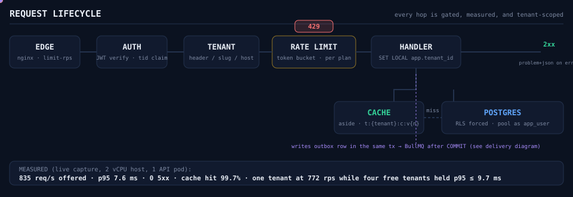
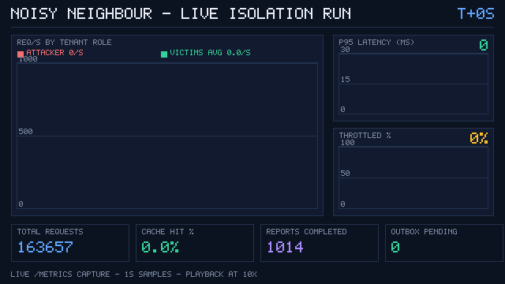
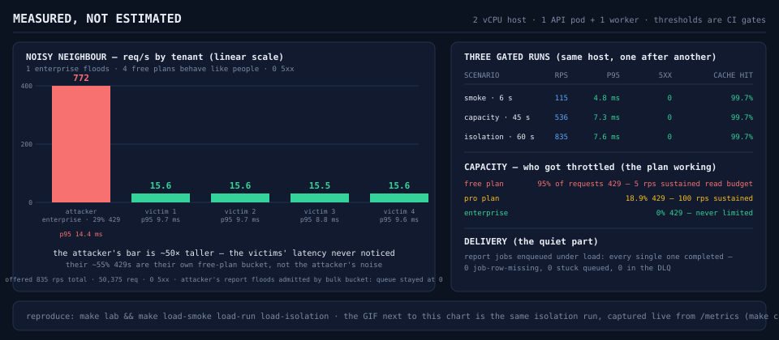
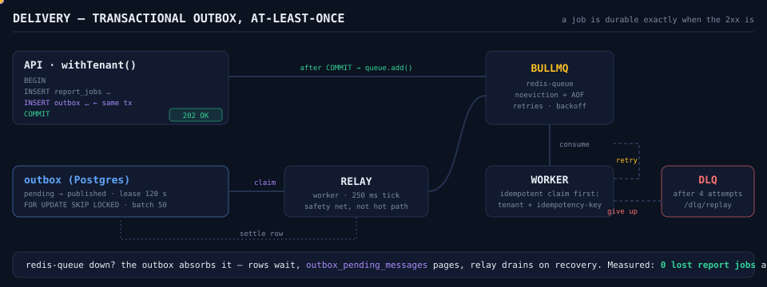
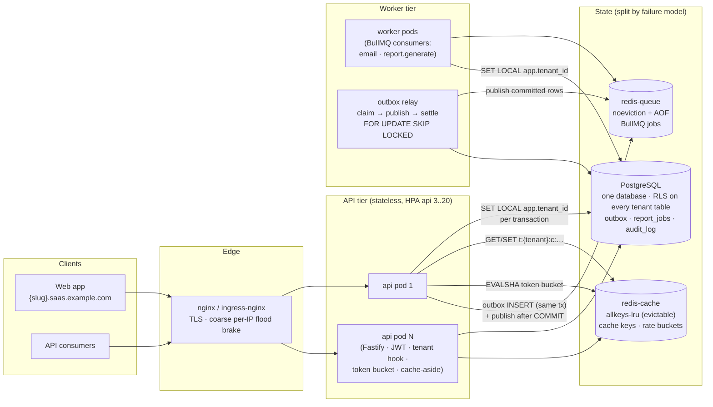

# Multi-Tenant SaaS

A production-shaped multi-tenant platform: **TypeScript · Fastify · PostgreSQL (Row-Level Security) · Redis (cache + token-bucket rate limiting) · BullMQ (transactional outbox) · Docker · Kubernetes (kustomize, HPA) · Prometheus + Grafana · k6 · GitHub Actions**.

The point of the repo is the decisions, not the features. Start with **[docs/ARCHITECTURE.md](docs/ARCHITECTURE.md)** — it explains the tenancy model, the queue/delivery guarantees, what happens when Redis dies, and shows real load-test numbers (including the noisy-neighbour experiment). Each major decision has an ADR in [`docs/adr/`](docs/adr/).

[](https://github.com/BFH-HAMID/Multi-Tenant-Saas/actions/workflows/ci.yml)
[](LICENSE)




## What you're looking at

| The claim                                                 | Where it's proven                                                                                                                                                                               |
| --------------------------------------------------------- | ----------------------------------------------------------------------------------------------------------------------------------------------------------------------------------------------- |
| One database, thousands of tenants, no cross-tenant leaks | RLS **enabled + FORCED** on every tenant table, `SET LOCAL app.tenant_id` per transaction, catalog-asserted by [`db/tests/schemaInvariants.int.test.ts`](db/tests/schemaInvariants.int.test.ts) |
| A noisy tenant cannot ruin everyone else's latency        | Per-tenant token buckets in Redis, one enterprise at **772 rps** while four free tenants held **p95 ≤ 9.7 ms** — captured live below                                                            |
| A queued job is never silently lost                       | Transactional outbox + idempotent claims; **0 lost report jobs** across every load run                                                                                                          |
| Rate limiting fails _safe_ when Redis blinks              | Degrades to per-pod buckets (`outcome="fallback"` alert), never to "allow everything"                                                                                                           |
| The dashboards can't lie                                  | Metric names are a code contract enforced by tests on both services                                                                                                                             |

```
apps/api        Fastify 5 REST API — JWT auth, RBAC, RLS-scoped queries, cache-aside,
                per-tenant rate limiting, Prometheus metrics, OpenAPI docs
apps/worker     BullMQ consumers (welcome email, reports), transactional-outbox relay,
                dead-letter queue + replay, metrics
packages/shared zod DTOs, plan limits, token-bucket model (TS + Lua parity), logger,
                metric-name contract
db              SQL migrations (schema + RLS policies + SECURITY DEFINER surface),
                migration runner, tenant-scoped client, seed
infra/compose   the full lab: postgres, redis-cache (evictable), redis-queue (durable),
                api×2, worker, nginx edge, prometheus, alertmanager, grafana
infra/k8s       kustomize base + dev/prod overlays (HPA, probes, PDBs, migrate Job)
                + prometheus-operator ServiceMonitors/PrometheusRule
infra/prometheus, infra/grafana   scrape config, alert rules, provisioned dashboards
loadtests       k6 scripts + the dependency-free Node runner they are generated from
tools/loadgen   the load generator (client+server percentiles, per-tenant fairness)
tools/gifcap    live /metrics → animated GIF (the capture below is generated, not mocked)
.github         CI (lint/type/test/integration/k8s-render/compose-smoke) and CD
                (GHCR images, digest-pinned kustomize deploy, migrate-first)
```

## Watch it work (measured, not mocked)

The GIF is a **live capture of `/metrics`** during the isolation load run — one frame per second, played at 10×. The attacker's throughput, the victims' latency, the throttle percentage and the cache-hit ratio are all read from the running API and worker; `make capture-gif` regenerates it.



**How to read it:** the red line is one enterprise tenant flooding the API (peak 921 r/s offered); the green line is the average of the four free-plan tenants next door. The p95 panel stays flat, the throttle panel is the limiter _working_, and the outbox-pending box stays at 0 — no back-pressure, no lost jobs, no 5xx.

The scoreboard for the same session (the GIF is the middle row):



Full numbers, methodology, the failure-mode matrix and the "what changes at 10×" plan are in [docs/ARCHITECTURE.md](docs/ARCHITECTURE.md#load-test-results).

## Quickstart (the whole lab, one command)

```sh
cp infra/compose/.env.example infra/compose/.env   # then edit the secrets
make lab        # builds + starts: postgres, redis×2, api×2, worker, nginx, prometheus, grafana
```

- API through the edge: **http://localhost:8080** (Swagger at `/documentation`)
- Grafana: **http://localhost:3001** (admin / your `GRAFANA_PASSWORD`) — dashboards provisioned
- Prometheus: **http://localhost:9090** — alerts loaded
- Metrics of a running API pod: `curl localhost:8080/v1/status`

Seed three demo workspaces (one per plan):

```sh
make compose-seed
```

| Workspace        | Slug      | Plan       | Owner login          | Password              |
| ---------------- | --------- | ---------- | -------------------- | --------------------- |
| Acme Rockets     | `acme`    | free       | `owner@acme.test`    | `Seed-Passw0rd-2026!` |
| Globex Analytics | `globex`  | pro        | `owner@globex.test`  | `Seed-Passw0rd-2026!` |
| Initech Platform | `initech` | enterprise | `owner@initech.test` | `Seed-Passw0rd-2026!` |

### Try it

```sh
# Login (tenant named by header; subdomain routing works the same way)
TOKEN=$(curl -s -X POST localhost:8080/v1/auth/login \
  -H 'content-type: application/json' -H 'x-tenant-slug: globex' \
  -d '{"email":"owner@globex.test","password":"Seed-Passw0rd-2026!","tenantSlug":"globex"}' \
  | node -pe 'JSON.parse(require("fs").readFileSync(0)).accessToken')

# Tenant-scoped reads (RLS: only this tenant's rows can ever come back)
curl -s localhost:8080/v1/projects?limit=3 -H "authorization: Bearer $TOKEN" -H 'x-tenant-slug: globex'

# Write + async report (outbox → BullMQ → worker), then poll the job
JOB=$(curl -s -X POST localhost:8080/v1/projects -H "authorization: Bearer $TOKEN" \
  -H 'x-tenant-slug: globex' -H 'content-type: application/json' \
  -H 'idempotency-key: demo-1' -d '{"name":"My project","tags":["demo"]}' | node -pe 'JSON.parse(require("fs").readFileSync(0)).id')
curl -s -X POST "localhost:8080/v1/projects/$JOB/reports" -H "authorization: Bearer $TOKEN" \
  -H 'x-tenant-slug: globex' -H 'content-type: application/json' \
  -H 'idempotency-key: demo-report-1' -d '{"format":"csv"}'
curl -s "localhost:8080/v1/reports/<jobId-from-above>" -H "authorization: Bearer $TOKEN" -H 'x-tenant-slug: globex'
```

Watch the plan difference: hammer the API as `acme` (free) and the token bucket throttles _that tenant only_, while `globex`/`initech` traffic stays fast — that's the noisy-neighbour experiment, packaged:

```sh
make load-isolation     # 1 enterprise floods, 4 free plans; victims' p95 is the gate
```

## The delivery path (why jobs don't get lost)



The outbox row commits **in the same transaction** as the business write, the fast-path publish happens only **after COMMIT** (publishing earlier is a dual-write in disguise — a worker can read a row that isn't visible yet), and the relay is the safety net that re-publishes anything the fast path missed. Consumers claim work by `tenant + idempotency key` before doing anything, so at-least-once delivery cannot become at-least-once _execution_. Full reasoning in [ADR-0005](docs/adr/0005-outbox-and-idempotency.md).

## Architecture at a glance



Two Redis instances on purpose: the cache may evict (every key is rebuildable), the queue may not (a job is someone's work). One instance with one `maxmemory-policy` cannot serve both — see [ADR-0006](docs/adr/0006-two-redis-instances.md).

## Everyday commands

```sh
make help          # everything
make check         # lint + typecheck + unit tests (what CI runs first)
make test-integration   # against Postgres+Redis (compose lab or your own)
make db-migrate    # apply pending migrations (advisory-locked, checksummed)
make db-seed       # demo tenants
make compose-scale N=3  # a real 3-pod test of the shared cache + shared buckets
make load-run      # capacity profile, three plans, server-side gates
make load-isolation     # the noisy-neighbour experiment from the GIF
make capture-gif        # regenerate the README's live capture
make load-regen    # regenerate the k6 scripts from their configs
make k8s-render-prod    # what CD would apply
```

## Running without Docker

`make run-api` / `make run-worker` run compiled code against local services (override `DATABASE_URL`, `REDIS_CACHE_URL`, `REDIS_QUEUE_URL`; see the Makefile). The system degrades deliberately without Redis: `QUEUE_DRIVER=outbox` keeps jobs in Postgres and the limiter falls back per-pod — see [the failure-mode matrix](docs/ARCHITECTURE.md#failure-modes).

## CI / CD

- **CI** (`.github/workflows/ci.yml`): lint → format check → typecheck → unit → integration (real Postgres + Redis services) → kustomize render of both overlays → docker builds → **compose-smoke**: the full lab boots and _both_ load runners (Node + k6 container) must pass their thresholds. It also verifies the checked-in k6 scripts match a regeneration from their configs — they can never drift by hand.
- **CD** (`.github/workflows/cd.yml`): builds and pushes `api`/`worker` images to GHCR (SHA + semver tags, provenance attestations), then — when a `KUBE_CONFIG` secret is configured — pins the prod overlay to the exact digests, runs the **migrate Job to completion first**, applies, and watches the rollout.

## Decisions, one file each

| ADR                                                         | Decision                                                                             |
| ----------------------------------------------------------- | ------------------------------------------------------------------------------------ |
| [0001](docs/adr/0001-shared-db-rls.md)                      | Shared database + forced RLS (vs schema-per-tenant / db-per-tenant), 4-layer defense |
| [0002](docs/adr/0002-bullmq.md)                             | BullMQ + transactional outbox; bare queue names, namespace as the `prefix` option    |
| [0003](docs/adr/0003-auth-sessions-and-credential-brake.md) | 15-min JWTs, rotating refresh with reuse detection, layered credential brake         |
| [0004](docs/adr/0004-rate-limiting-token-bucket.md)         | Redis token buckets keyed `tenant:{id}:{route}`, plan geometry, safe degradation     |
| [0005](docs/adr/0005-outbox-and-idempotency.md)             | Outbox + idempotent claims; publish only after COMMIT; DLQ with replay               |
| [0006](docs/adr/0006-two-redis-instances.md)                | Two Redis instances — evictable cache vs durable queue                               |
| [0007](docs/adr/0007-observability-metric-contracts.md)     | Metric names as a tested contract; cardinality budget; separate scrape port          |
| [0008](docs/adr/0008-kubernetes-deployment-shape.md)        | Two Deployments, migrate-first Jobs, digest pinning, probe/HPA policy                |

## Where to read next

| Doc                                                                  | What it answers                                                                |
| -------------------------------------------------------------------- | ------------------------------------------------------------------------------ |
| [docs/ARCHITECTURE.md](docs/ARCHITECTURE.md)                         | tenancy model, queue semantics, failure modes, **load-test results**, 10× plan |
| [docs/adr/](docs/adr/)                                               | one decision per file, with the options that lost                              |
| [docs/diagrams/](docs/diagrams/)                                     | system, request-lifecycle and delivery diagrams (mermaid)                      |
| [infra/compose/docker-compose.yml](infra/compose/docker-compose.yml) | the lab topology, annotated                                                    |
| [infra/k8s/](infra/k8s/)                                             | deployment shape, HPA, probes, monitoring integration                          |

## Generated artifacts (nothing here is hand-faked)

| Artifact                            | Generator                                                                                 |
| ----------------------------------- | ----------------------------------------------------------------------------------------- |
| `docs/assets/isolation-capture.gif` | `make capture-gif` → [tools/gifcap](tools/gifcap/gifcap.mjs) sampling live `/metrics`     |
| `docs/assets/*.svg`                 | hand-authored, colors kept in sync with the dashboards; numbers taken from the runs above |
| `loadtests/*.js` (k6)               | `make load-regen` from `loadtests/*.config.json`; CI fails if they drift                  |
| `infra/grafana/dashboards/*.json`   | `node infra/grafana/dashboards/build.mjs`                                                 |

## Development notes

- Node ≥ 22, npm workspaces, TypeScript project references (`npm run build` builds everything in dependency order).
- Migrations are plain SQL applied in one transaction each, with an advisory lock so N runners cannot race; applied checksums are tracked — an edited migration fails loudly.
- The API connects to Postgres as `app_user` (no DDL, no `BYPASSRLS`); only the migrate Job uses the admin URL. RLS invariants are asserted against the catalog by `db/tests/schemaInvariants.int.test.ts`.
- Metric names are a contract (`packages/shared/src/metrics.ts`) enforced from both sides by unit tests, so dashboards and alert rules cannot reference a metric that nothing emits.
